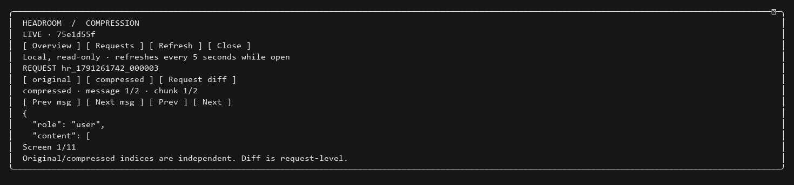

# Native sidebar demo

These are the native Claude Code 2.1.290 terminal pane from the authenticated
Windows acceptance session on October 6, 2026. The screenshots were rendered
from recorded ConPTY ANSI output and framed around the pane to exclude the
surrounding conversation and local paths. The displayed metrics are unchanged;
these are not the protocol-host E2E fixture or generated UI mockups.

## Live overview

The latest request's exact savings were 22,801 tokens, matching proxy records.
Native Claude context usage is displayed separately from request savings.
Retained totals cover the current tagged conversation, including inherited
children, rather than unique context or lifetime usage.

## Request history

Each retained request exposes its own accounting and a message-review action.

## Message inspector

Message inspection requires explicitly enabled capture. This frame shows the
compressed side, independent message indices, preview chunks and text paging.
See [the validation record](../VALIDATION.md) for checks and platform limits.
