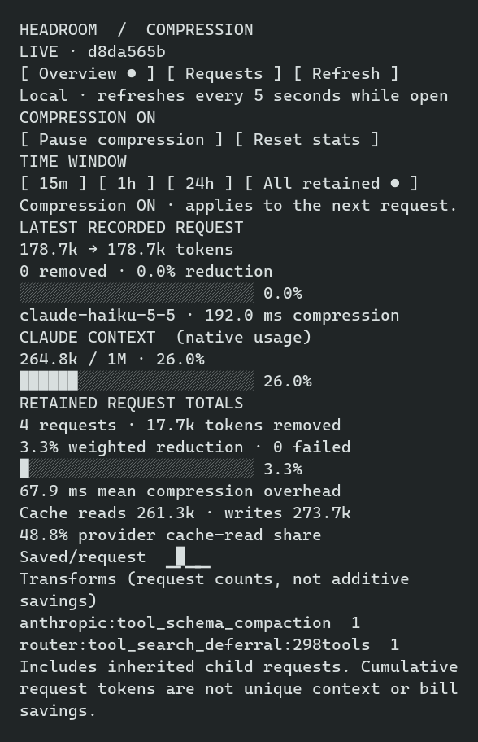
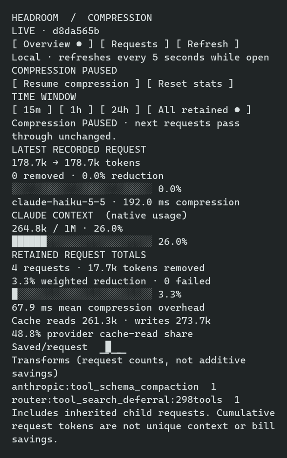
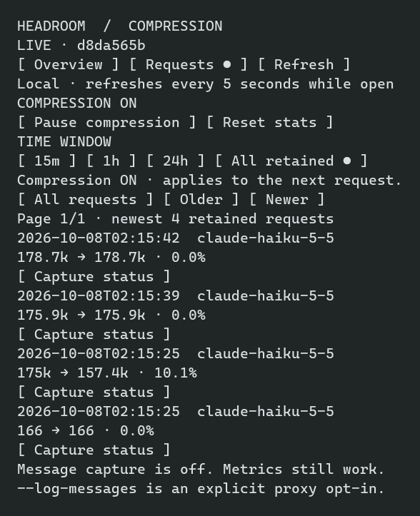

# Native sidebar demo — 0.1.2

Captured from a real Claude Code 2.1.293 / Haiku 5.5 session through Headroom on
October 7, 2026. Haiku built a tiny dependency-free todo SPA in a disposable
worktree using fictional todo fixtures. These images are rendered from that
session's ConPTY ANSI output, cropped to the native sidebar. They are not host
fixtures or generated UI mockups; displayed metrics and controls are unchanged.

Only the sidebar cells were published. Account details, workspace paths,
conversation text, credentials and raw session logs are excluded. Message
capture was off. The temporary session, worktree, fixtures and capture runtime
were removed after the images were pushed and their remote copies verified.

## Live overview

The retained window contains four successful task requests and 17,687 tokens
removed, a 3.34% weighted reduction (displayed as 3.3%). One request recorded a
10.1% reduction; the latest request had no reduction. Native context usage is
shown separately. These are retained request metrics, not billing savings or
unique context reduction.

## Paused compression

Pause and resume were invoked through the native pane's keyboard control and
confirmed against the live companion. Closing the pane does not resume compression.

## Request history

All retained requests belong to the same throwaway Haiku session. Message capture
is disabled; the pane explicitly reports that policy rather than showing bodies.

The adjacent `.txt` files preserve the same cropped TUI text. The small
[native-demo-evidence.json](native-demo-evidence.json) records model, version,
source commit and aggregate checks without exporting a transcript.
